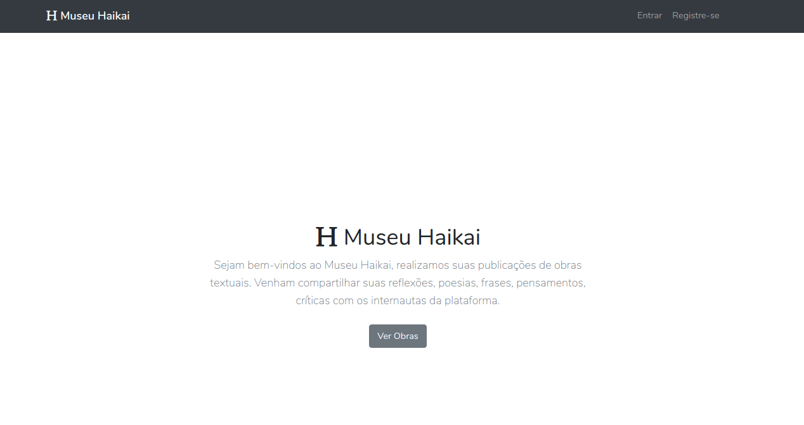

## Museu Haikai

Sejam bem-vindos ao Museu Haikai, realizamos suas publicações de obras textuais.
Venham compartilhar suas reflexões, poesias, frases, pensamentos,    críticas com os internautas da plataforma.

## Requisitos

- PHP 
- MySQL
- NPM
- Composer
- [Laravel Framework](https://laravel.com/docs/7.x/installation#server-requirements)


## Como instalar

Escolha um diretório de seu preferência e rode o seguinte comando:

```bash
git clone https://github.com/jvbs/museu_haikai.git
cd museu_haikai/
```

Agora iremos instalar as dependências do projeto, utilizando o comando:

```bash
composer install
npm install
```

Crie um arquivo `.env` na raiz do projeto (utilize o conteúdo do `.env-example`), e neste arquivo, altere as variáveis de ambiente:

```bash
DB_HOST=[host do seu banco]
DB_PORT=[porta do seu banco]
DB_DATABASE=[banco de dados]
DB_USERNAME=[usuario server]
DB_PASSWORD=[senha server]
```
Crie uma chave para a aplicação e gere tabelas necessárias após isso:
```bash
php artisan key:generate
php artisan migrate
```

Agora de executar:
```bash
php artisan serve
```

E em outro terminal:
```bash
npm run watch
```
